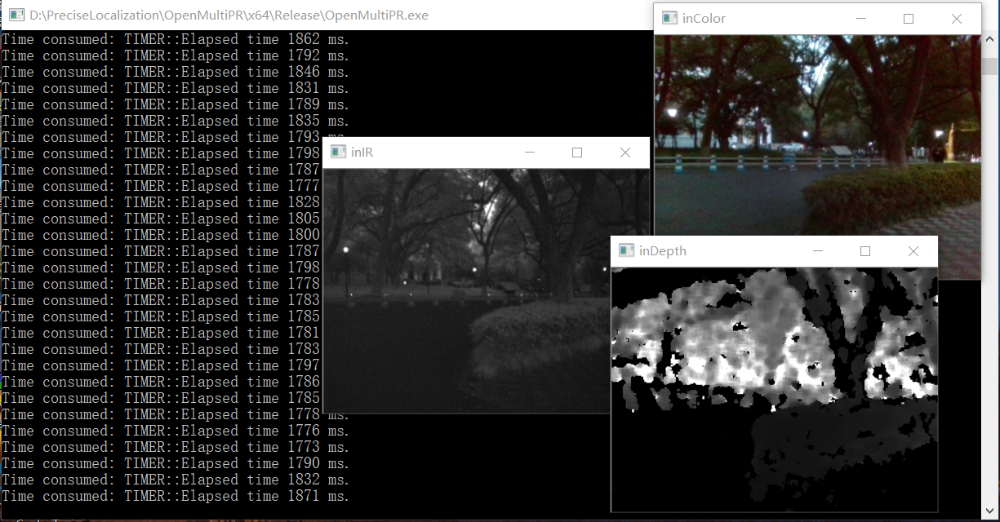

# Open Multimodal Place Recognition

If you are using this code in your research, please cite the papers:\
OpenMPR: Recognize Places Using Multimodal Images for People with Visual Impairments

Environments: Ubuntu

*OpenCV 4.0 (64 bit)*: set OpenCV path as OpenCV4_DIR in system environments\
*DBoW3*: set DBoW3 path as DBoW3_DIR in system environments\
*FFTW3*: set FFTW path as FFTW_DIR in system environments

## Conguration File
The configuration file `Config.yaml` is in the folder of `OpenMultiPR`. In the yaml file, the dataset and BoW vocabulary paths are assigned. Other parameters could also be switched, the detailed information is labeled in `Config.yaml`. 